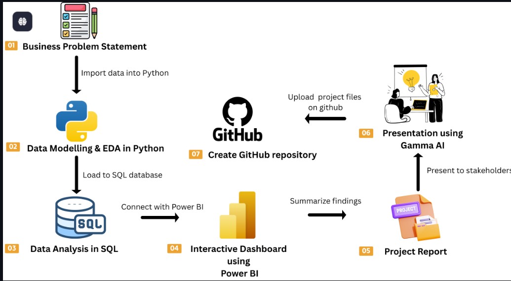

# 🛒 Customer Shopping Behavior Analysis  
### End-to-End Data Analytics Project | Python · SQL · Power BI

---

## 📌 Project Overview

This project presents an **end-to-end data analytics solution** for analyzing customer shopping behavior using real-world retail transaction data. The goal is to uncover actionable insights related to customer purchasing patterns, loyalty, discount dependency, and product performance to support **data-driven business decisions**.

The project follows an **industry-standard analytics workflow**, starting from business problem definition and data preparation to SQL-based analysis, interactive visualization, and final reporting.

---

## 🎯 Business Problem Statement

Retail businesses collect large volumes of customer transaction data, but without structured analysis, this data remains underutilized. Organizations often lack clear insights into:

- Why customers purchase certain products  
- How discounts and subscriptions influence spending  
- Which customer segments contribute most to revenue  
- Which products are price-sensitive or high-performing  

The objective of this project is to analyze customer shopping behavior data to identify trends, segment customers based on loyalty, evaluate discount effectiveness, and highlight high-impact business opportunities.

---

## 🧠 Project Objectives

- Understand customer purchasing behavior across demographics and categories  
- Analyze the impact of discounts and shipping types on spending  
- Segment customers into New, Returning, and Loyal groups  
- Identify top-selling and discount-dependent products  
- Present insights through an interactive, decision-focused dashboard  

---

## 🔄 Project Workflow

*Figure: End-to-end customer shopping behavior analytics workflow.*

---

## 🗂 Dataset Summary

| Attribute | Details |
|--------|--------|
| Total Records | 3,900 customer transactions |
| Total Features | 18 |
| Data Type | Retail transactional data |
| Missing Values | 37 (Review Rating column only) |

**Key Data Categories**
- Customer Demographics (Age, Gender, Location, Subscription Status)  
- Purchase Details (Item, Category, Amount, Season, Size, Color)  
- Behavioral Metrics (Discount Applied, Previous Purchases, Frequency, Ratings, Shipping Type)  

---

## 🛠 Tools & Technologies

| Tool | Purpose |
|---|---|
| **Python (Pandas, NumPy)** | Data cleaning, preparation, EDA |
| **PostgreSQL (SQL)** | Structured business analysis |
| **Power BI** | Interactive dashboards & visualization |
| **Jupyter Notebook** | Exploratory analysis |
| **GitHub** | Version control & documentation |

---
Business Problem
↓
Data Preparation & EDA (Python)
↓
SQL-Based Business Analysis (PostgreSQL)
↓
Interactive Dashboard (Power BI)
↓
Insights, Report & Presentation
↓
GitHub Portfolio

---

## 📊 Key Analysis Performed

- Revenue analysis by gender and age group  
- Customer segmentation (New, Returning, Loyal)  
- Discount dependency analysis at product level  
- Top-performing products and categories  
- Subscription vs non-subscription behavior  
- Shipping type impact on purchase amount  
- Repeat buyers and loyalty trends  

---

## 📈 Power BI Dashboard

The Power BI dashboard provides a **decision-maker view** of customer behavior with:

- KPIs (Total Customers, Avg Purchase Amount, Avg Rating)  
- Revenue & sales by category  
- Customer segmentation overview  
- Revenue contribution by age group  
- Interactive filters for deeper exploration  

📌 *Designed for non-technical stakeholders.*

---

## 💡 Key Business Insights

- Loyal customers form the largest segment and drive repeat purchases  
- Express shipping users spend more per transaction  
- Several products show high dependency on discounts, indicating price sensitivity  
- Subscription customers contribute significantly to overall revenue  
- Young and middle-aged customers generate the highest revenue  

---

## 📌 Business Recommendations

- **Boost Subscriptions:** Promote exclusive benefits to increase conversion  
- **Customer Loyalty Programs:** Reward repeat buyers to strengthen retention  
- **Optimize Discount Strategy:** Reduce dependency while protecting margins  
- **Product Positioning:** Highlight top-rated and best-selling products  
- **Targeted Marketing:** Focus on high-revenue age groups and express users  

---

## 📁 Repository Structure

customer-shopping-behavior-analysis/
│
├── dataset/
│ └── customer_shopping_data.csv
│
├── notebooks/
│ └── eda_analysis.ipynb
│
├── sql/
│ └── business_queries.sql
│
├── dashboard/
│ └── customer_behavior_dashboard.pbix
│
├── report/
│ └── Customer_Shopping_Behavior_Analysis.pdf
│
├── presentation/
│ └── Customer_Shopping_Behavior_Analysis.pptx
│
├── images/
│ └── dashboard_preview.png
│
└── README.md

---

## 📌 Conclusion

This project demonstrates a **complete, industry-aligned data analytics workflow**, converting raw customer transaction data into meaningful business insights. By combining Python, SQL, and Power BI, the project highlights how data analytics can support strategic decisions related to customer retention, pricing, and product strategy.
---

## 📬 Contact

If you have questions, feedback, or collaboration opportunities, feel free to connect.

⭐ *If you found this project useful, consider giving it a star!*  

## 🔄 Project Workflow

